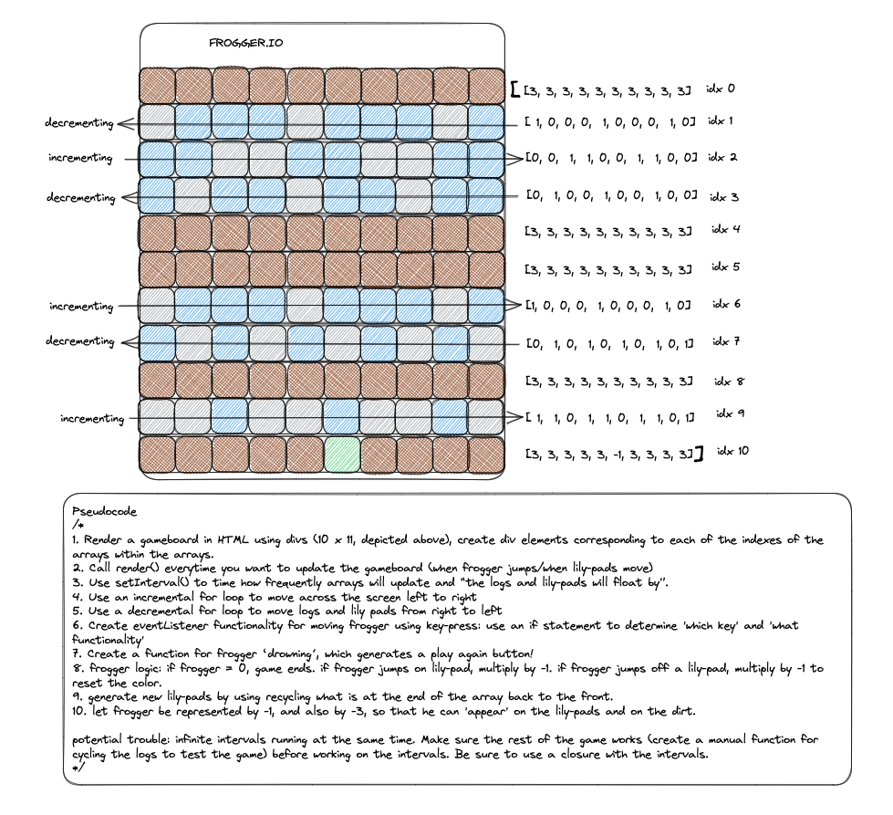
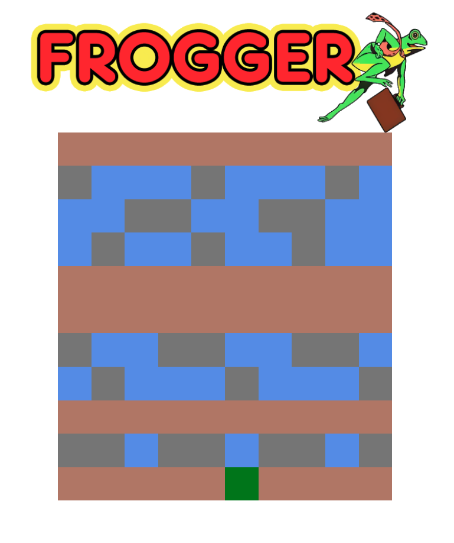
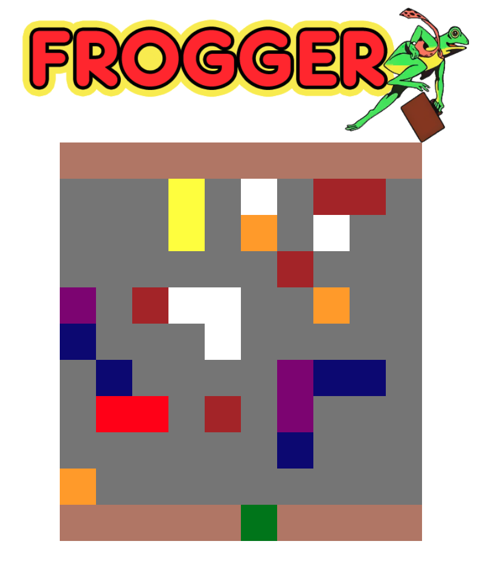

# Frogger.io
- For my first project, I decided to recreate one of my favorite games from adolescence. Frogger was first released in 1981, developed by Konami and produced and released by Sega. I remember playing Frogger on one of the arcade machines at the roller rink just outside of town. Years later, I enjoyed the refreshing remake concept "Crossy Road". The logic seemed intricate but straightforward, and the prospect of a DOM-updating game was irresistable.

## Technologies
- This project required use of HTML, CSS, and JavaScript.

## Wireframe
### Preliminary Sketch, Detailing the Basic Features of the Project

### Fully Rendered Gameboard

### Fully Rendered Gameboard for Level 2

### Example of Gameplay on Easy (Interval, 1500)
![][figure_3.mov]

## Pseudocode
### Modals
- Game modals are switched on and off by adding and removing prestyled 
- Set up an intro screen modal with a play button and a difficulty menu.
- Play button toggles the modal to not 'open' and initializes the gameboard.
- Gameboard will toggle to 'closed' ("display: none") and the gameover modal screen will toggle to 'open' when gameOver() is called.
### Gameboard
- The interactive gameboard uses the DOM to link HTML DIV elements to a JS array of arrays, in which each of the arrays represents a row in the gameboard.
- init() performs the following actions: 1. calls resetFrogger(), which will reset the frogger object's values to their base in case the game is restarting; 2. sets the gameboard based on the value of the variable 'level', which is preset to 1 and can be updated to 2 when Frogger completes the first level; 3. calls setRows(), which sets each of the gameboard rows as the value of a value within a gameboard object, making it simpler to access and manipulate their contents; sets an important frogHop variable (which records the array that Frogger is in) equal to gameboard.row10; calls render()
- render() performs the following actions: 1. calls renderBoard(), which runs a for loop to iterate through the array of arrays. At each of these iterations, a function is called, which iterates through the array at the corresponding index. The numbers at each of the indexes in each of these 'row arrays' correspond to a color as recorded in the colors object. The CSS background-color for each of the divs is updated accordingly; 2. if the player did not select a difficulty option, intervalSpeed is set to 1000; 3. if level is 1, riverInterval is set using the arguments 'riverFlow()' and 'intervalSpeed', else if level is 2, trafficInterval is set using the arguments 'traffic()' and 'intervalSpeed'; 4. the 'theme' music is set to play.
### riverFlow()
- at each interval, riverFlow calls checkScore(), which checks for three conditions: 1. if frogger.life becomes zero (i.e. he jumps into water because frogger.life is multiplied by the index value he is hopping to), run gameOver(); 2. else if none of gameboard.row(s) contain frogger (i.e. frogger was popped or shifted out of the array by riverFlow() or the player hopped out of the gameboard.row), call gameOver(); 3. else if frogger.row is 0 (i.e. frogger has made it across the gameboard), call winner().
- for each of the 'west' bound river rows, the pattern of logs is maintained by checking if the start the log pattern has reached a preset index. If that index contains a 1 (log) or -1 (frogger), then it will push a 1 into the array, thereby restarting the pattern; else if that index contains a 0 (water), it will push another 0 into the array. In order to create the illusion of movement, the shift method removes the index at the 'west' end of the array, thus every index has moved to the 'west'. These rows are updated in this manner at each interval.
- for each of the 'east' bound river rows, the pattern of logs is maintained by checking if the start the log pattern has reached a preset index. If that index contains a 1 (log) or -1 (frogger), then it will unshift a 1 into the array, thereby restarting the pattern; else if that index contains a 0 (water), it will unshift another 0 into the array. In order to create the illusion of movement, the pop method removes the index at the 'east' end of the array, thus every index has moved to the 'east'. These rows are updated in this manner at each interval.
- froggerLogger() is called to update frogger.column in order to account for the movement when frogger is ready to jump off of a moving log; if frogger is in an 'east' bound river, frogger.column increases by 1; else if frogger is in a 'west' bound river, frogger.column decreases by 1.
- renderBoard() renders these changes in the DOM. 
### traffic()
- sets the variables right and left to frogger.column and frogger.column-2 respectively.
- carSplat() if carSplatRow AND carSplatCol (which will have been updated in the previous interval, as they are updated after this function is called) are equal to frogger.row and frogger.column respectively, gameover() is called and carSplatRow and carSplatCol are reset to null. However, if, for instance, frogger had hopped forward, backward, or to the side before the next interval to avoid the oncoming traffic, and, therefore, carSplatRow AND carSplatCol are not BOTH equal to frogger.row and frogger.column, then carSplat() performs no action.
- if frogger is in an 'east' bound lane of traffic', carSplatCol is set to frogHop[left] and carSplatRow to frogger.row; else if frogger is in a 'west' bound traffic lane, carSplatCol is set to frogHop[right] and carSplatRow to frogger.row. This is so that the next interval can check if Frogger has died or not. 
- entranceRamp() is called on each of the 'west' bound traffic rows. Using Math.random, there is 2/3 chance it will push 1 (road) into the array and 1/3 chance it will push a random number from 4-10 (which correspond to the various car colors in the colors object). Then shift will remove the value at idx 0, giving the illusion of the cars driving down the highway. 
- exitRamp() is called on each of the 'east' bound traffic rows. Using Math.random, there is 2/3 chance it will unshift 1 (road) into the array and 1/3 chance it will unshift a random number from 4-10 (which correspond to the various car colors in the colors object). Then the array will pop the value at idx 0, giving the illusion of the cars driving down the highway. 
- stationaryFrogger() uses conditionals to correspond the particular functionality to the particular gameboard.row in question. Essentially, for 'east' bound lanes that contain -1 (frogger), frogger.previousColorLeft is set to gameboard.row_[left], then, at gameboard.row_, the index value equal to the variable 'left' is spliced with frogger.previousColorLeft, the index value equal to the variable 'center' is spliced with -1, and the index value equal to the variable 'right' is spliced with 1. For 'Wast' bound lanes that contain -1 (frogger), frogger.previousColorRight is set to gameboard.row_[right], then, at gameboard.row_, the index value equal to the variable 'right' is spliced with frogger.previousColorRight, the index value equal to the variable 'center' is spliced with -1, and the index value equal to the variable 'left' is spliced with 1. This function makes it so that at each interval, Frogger is not moved along with the rest index values in the rows. 
### Frogger Controls
- There are four functions defining frogger's movement, which correspond to the standard WASD controls and arrow keys, using keyboard event listeners. In each movement, the color of the square that frogger is hopping away from is reset by setting it equal to frogger.previousColor Next, for hopForward() and hopBackward(), frogger.row is adjusted by 1 inversely, and for hopLeft() and hopRight() frogger.column is adjusted by 1 accordingly. frogHop is set to the Board at idx frogger.row. A conditional is set for these movements that only affects the game on the level 2 board. Next frogger.previous color is set to the color of the square to be jumped on (so that it can be replaced when Frogger inevitably hops away!). frogger.life is multiplied by the number of the square he is jumping onto. Then the square that frogger is hopping onto is spliced with a -1 (frogger). Lastly, the hop sound is played and the board is rendered to display these changes.

## Future Updates
- Add a scroll feature and random map generator that pushes newly, randomnly generated row arrays into the map array. 
- Add a score counter that goes up for each new row frogger makes it through a level and/or for each level that Frogger completes.

# Without Further Ado:
- Click [HERE](https://m-j-terry.github.io/unit-1-project/) to play!